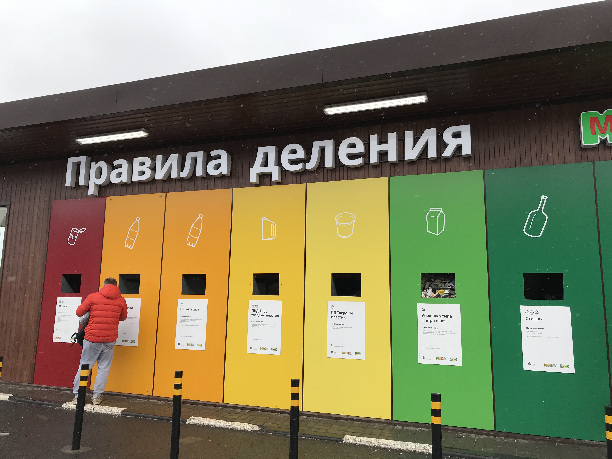
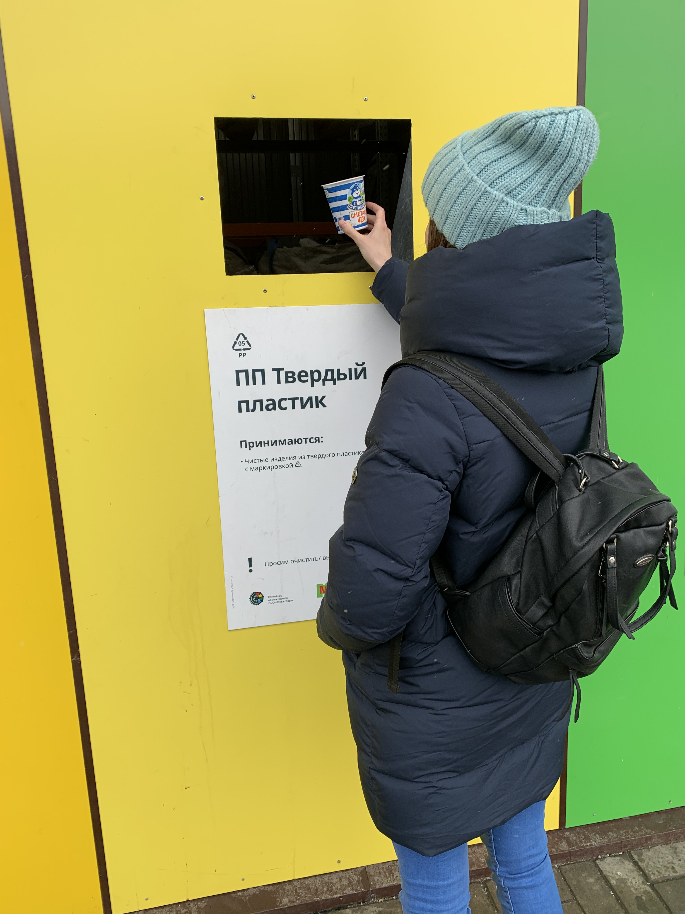
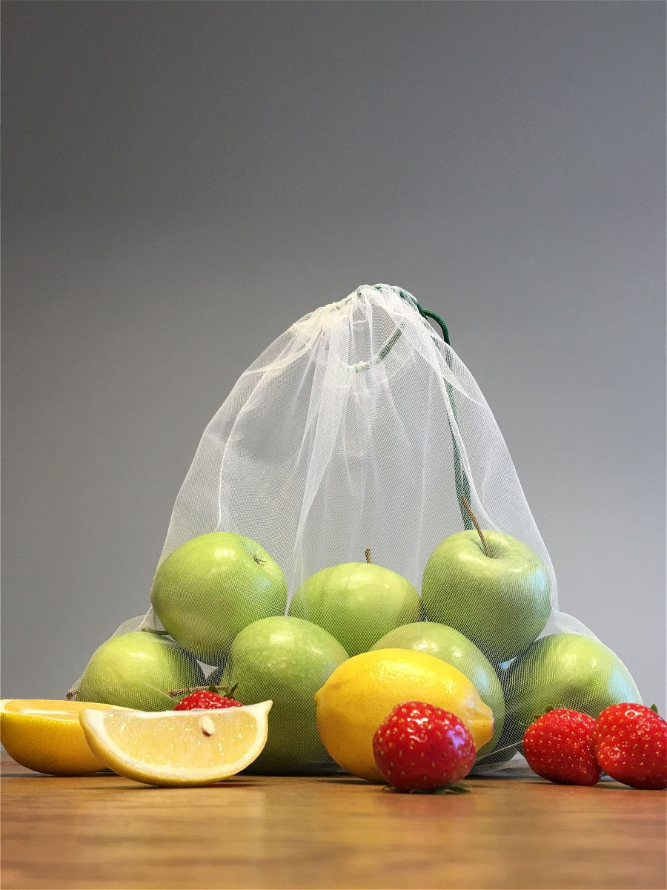
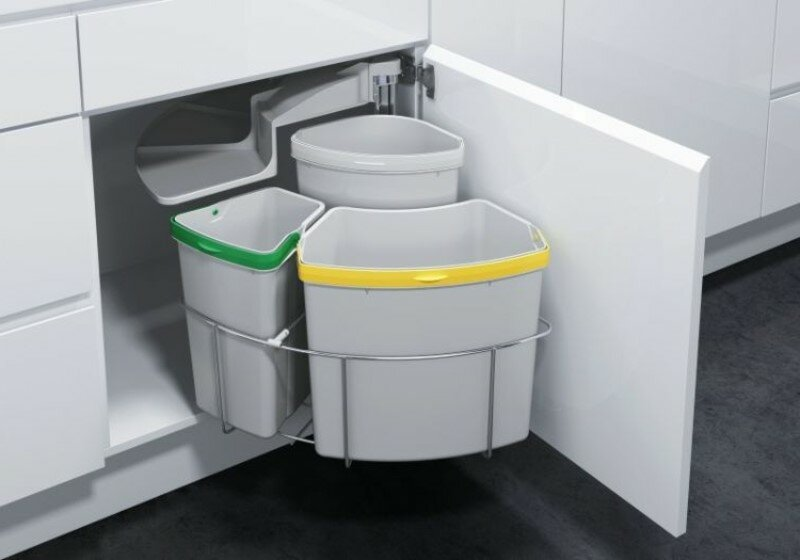

Первый шаг к раздельному сбору мусора я сделала еще в школе — во дворе появился контейнер для пластиковых бутылок и я старалась отделять их от остальных отходов. Но потом шла в супермаркет и набирала годовой запас полиэтиленовых пакетов. Тогда я думала, что сортировка бутылок — достаточный вклад в защиту экологии.

В нашей стране скоее всего еще не скоро появится настолько отлаженная система раздельного сбора мусора, как в США и странах Европы. Но, в первую очередь, нужно начинать с себя — и мы с Альбертом решили попробовать.

Сначала мы просто разделяли пластиковые бутылки, стекло, картон, металл, тетрапаки. Потом оказалось, что существует много разных видов пластика, а также материалы, не подлежащие переработке. Началось время, когда смотришь на маркировку на каждой коробочке и ругаешь производителя Великолукских сосисок за неэкологичную упаковку. Через месяц я уже с легкостью отличала 5PP от других видов пластика и могла на ощупь определить, что материал упаковки не подлежит переработке.

На замену полиэтиленовым пакетам мы купили многоразовые экомешочки. В них удобно складывать овощи и фрукты.

Также мы не покупаем пакеты на кассе — носим свои или складываем продукты в рюкзак.

Поначалу я думала, что мне надоест мыть каждую упаковку. Но в итоге быстро привыкла и заметила, что стала более осознанно относиться к выбору продуктов и вещей. Пока что мы складываем мусор разных видов в пакеты, но в будущем хотелось бы приобрести специальные контейнеры, чтобы было удобнее.

В городах России появляются новые пункты для сбора мусора. Узнать, где находится ближайший пункт приема вторсырья можно с помощью [карты Recyclemap](https://recyclemap.ru/). 

Я планирую продолжать раздельный сбор мусора и надеюсь, что в нашей стране начнут уделять должное внимание проблемам экологии, а осознанных людей будет становиться все больше.